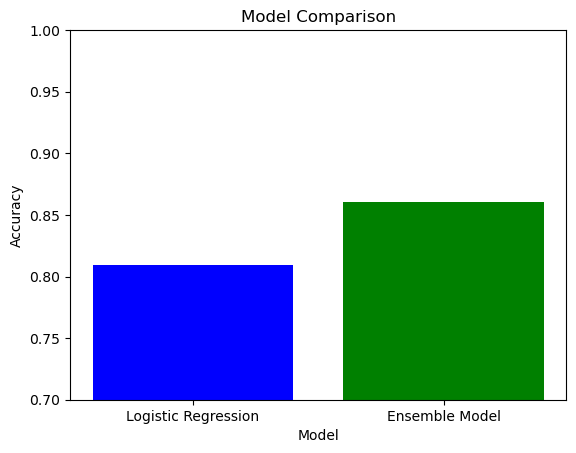

# Employee Attrition Prediction

**Project Overview**

This project aims to predict employee attrition using machine learning techniques. By analyzing various factors such as job satisfaction, work-life balance, and compensation, we can identify employees at risk of leaving the organization.

**Data Description**

The dataset used in this project contains information about employee demographics, job role, job satisfaction, work-life balance, and other relevant factors. The target variable is "Attrition," indicating whether an employee has left the company.

**Data Preprocessing**

1. **Data Loading:**
   - Read the CSV file containing the HR data.
2. **Feature Engineering:**
   - Convert categorical features into numerical representations using LabelEncoder.
3. **Data Splitting:**
   - Divide the dataset into training and testing sets for model development and evaluation.
4. **Feature Scaling:**
   - Standardize numerical features to improve model performance.

**Model Development**

1. **Logistic Regression:**
   - Train a logistic regression model to predict employee attrition.
2. **Ensemble Model:**
   - Combine multiple models (Logistic Regression, SVM, Random Forest) using a voting classifier to improve predictive accuracy.

**Evaluation**

- Evaluate the performance of both models using accuracy score.

**Results**

- **Logistic Regression:**
  - Accuracy: ~80.95%
- **Ensemble Model:**
  - Accuracy: ~86.05%

**Future Improvements**

- Explore advanced feature engineering techniques.
- Experiment with different hyperparameter tuning methods.
- Consider using more sophisticated machine learning algorithms.
- Implement cross-validation for robust model evaluation.

**Conclusion**

This project demonstrates the effectiveness of machine learning in predicting employee attrition. By leveraging the insights gained from this analysis, organizations can take proactive steps to retain valuable employees and improve overall workforce stability.
